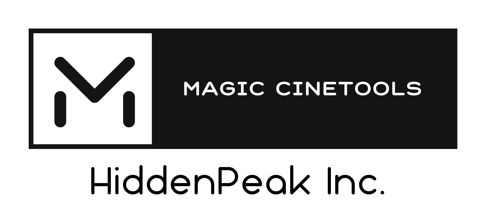

# Startup-Corporation

Open Source Hardware Biz-plan

The plan is to provide a platform for open source hardware with open source functionality, closed source commercialization of user interaction firmware, and a demonstration case for that platform. This Github project, is a demonstration case.

## TIMELINE

GMT+8

- 2022-08-30 coding for it.
- 2022-09-21 Functional verification completed
- 2022-11-03 Hardware selection for open source version completed
- 2022-11-15 Start incorporating a U.S. company
- 2022-11-25 Completed Notarize for USPS Form 1583
- 2022-12-08 Over 17 business days, still waiting for the DE Division of Corporations to process filings (Firstbase.io tell me 10-15 business days). Maybe Start day is from 25,Nov. Today, I spoke with the BMD dealer in Sichuan, China today. They contacted the head of BMD China and BMD they are willing to test and promote the product to enrich their own product features and application scenarios. bmd's sichuan distributor plans to start marketing preparation in february 2023 and bmd plans to promote our products and services at a distributor meeting in Singapore.
- 2022-12-10 HiddenPeak Inc. Filed and approved by the Secretary of State, the Certificate of Incorporation legally creates the corporation as a registered entity in Delaware.
- 2022-12-18 Create a Logo Via tailorbrands Standard Plan.
- 2022-12-18 Preparing to file annual reports 
- 2022-12-18 submit BE-13 (Claim for Exemption)
- 2022-12-18 BE-13 Submission Confirmed, Thank You
- 2022-12-30 signatured Form SS-4 & Form 8821 via Firstbase.io (Online type my name)
- 2023-01-05 Mercury Bank Account apply, For companies whose shareholders are corporations, the forms that need to be filled out are not too friendly. I'm going to write an email to give them feedback.
- 2023-01-06 Mercury Bank Account Active,There are Checking & Saving Account, Debet Card.
- 2023-01-19 The business service provider has launched a new registered agent service package, dubbed Autopilot, which includes annual reporting and franchise tax filing services, and a self-service form-filling tool on foreign-invested enterprises (Form 5472 & Form 1120). An additional $200 is required, but since the previous registered agent service is already 2 months old, the discounted amount is a retroactive $179.

The story is continuing

## Paperwork

- [BUSINESS PRE WORK](./prepWork.md)
- [FRISTWORK](./first-ready.md)

## Current Expenses

- Firtsbase Start™ $499
- Firstbase Agent™ $99/year
- Firstbase Agent™ upgrade to Autopilot Plan for 10 months $179
- Mailroom Delaware $35/mo (FROM 11/15/2022)
- Chinese Resident ID Card Translation Fees RMB 100 Yuan
- tailorbrands Standard Plan $71.88/year (discount 35% With coupon)
- Firstbase Agent™ 2022 Annual Report Filing Fee $100
- Total $81054 AND RMB 100 YUAN

